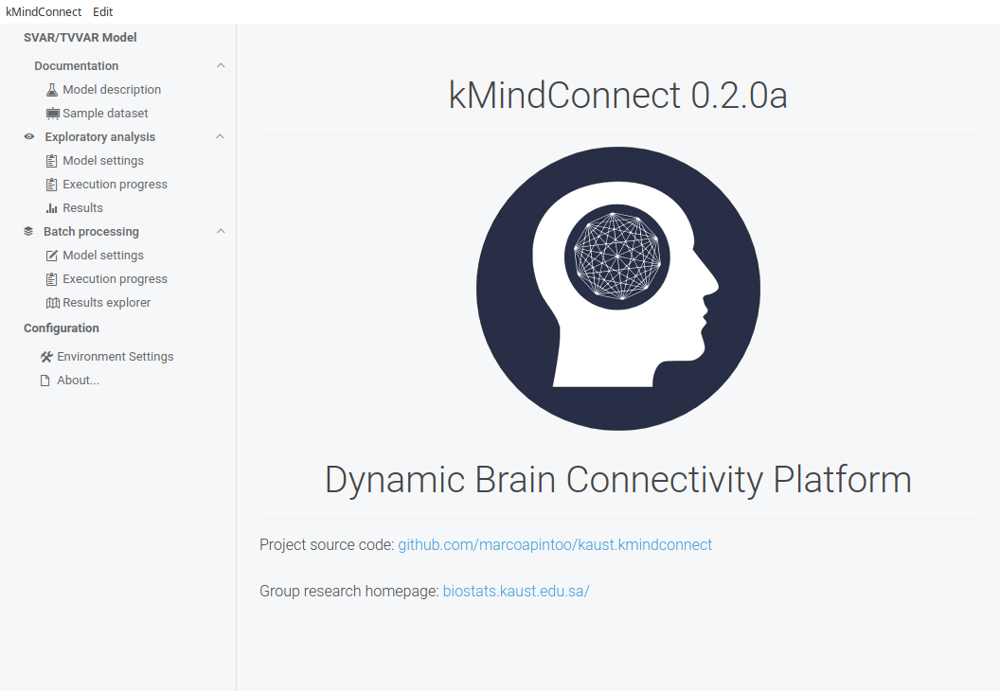
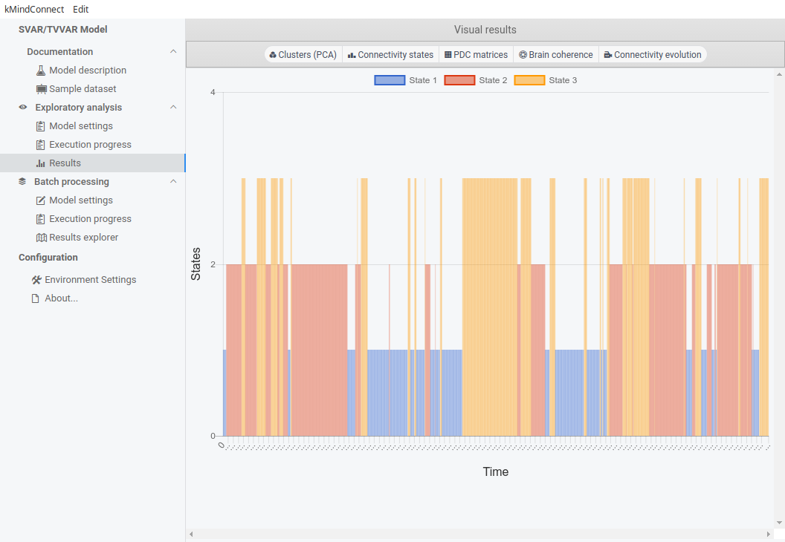
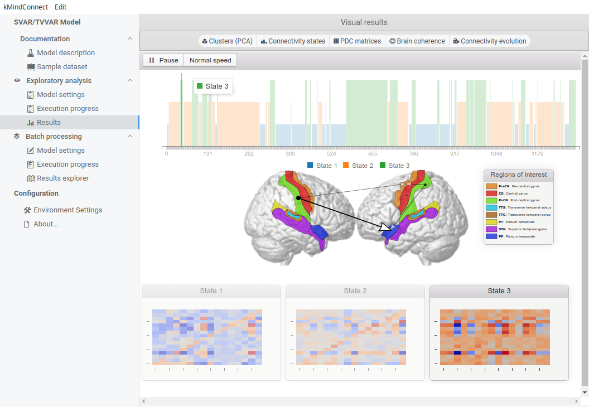
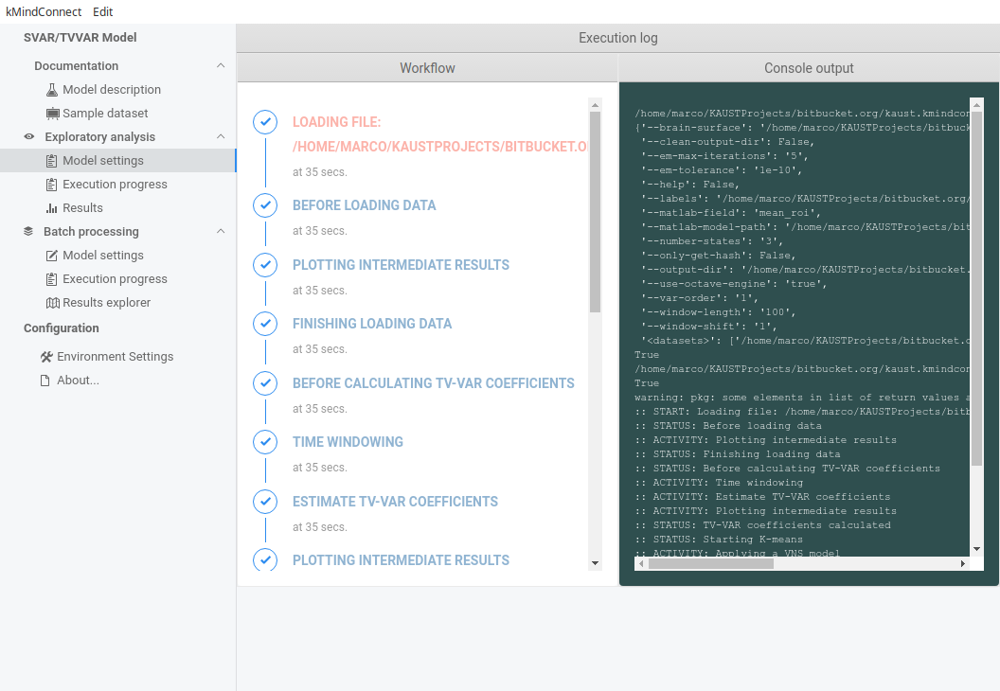

# kMindConnect



# Features

## Timeline of states



## Visual animation



## Simulation timing




# Requirements

## Preparing the environment on Ubuntu/Debian


* Step 1: **Install Octave**
```
    sudo apt install octave octave-signal octave-statistics
```
* Step 2: **Install Anaconda/Python3**
* Step 3: **Install additional Python packages**
```
    pip install oct2py 
    conda install plotly
    conda install docopt
```
* Step 4: **Install node and electron** (*Only for building the software*)
```
    sudo apt install node
    sudo npm install -g electron --unsafe-perm=true --allow-root
```

# License

Licensed under either

* GPL license, Version 3.0, (GPL-LICENSE or https://opensource.org/licenses/GPL-3.0)
* MIT license (MIT-LICENSE or http://opensource.org/licenses/MIT)

